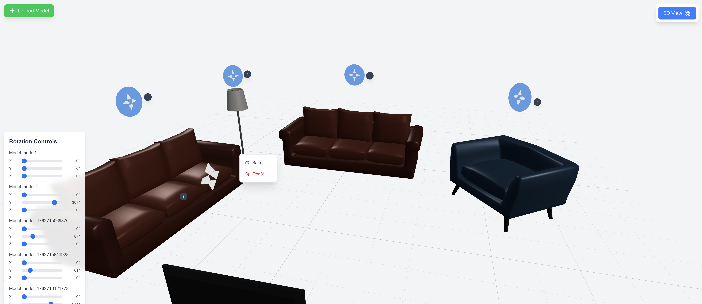

# 3D Model Management Application

Interaktivna web aplikacija za upravljanje 3D modelima sa podrškom za 2D/3D prikaze, drag & drop funkcionalnost, upload modela, brisanje sakrivanje, rotaciju i real-time sinhronizaciju sa Firestore bazom podataka.



## O Projektu

Ova aplikacija je razvijena kao zadatak koji demonstrira:
- Integraciju 3D grafike u web aplikaciju
- Real-time perzistenciju podataka
- Modernu React/Next.js arhitekturu
- TypeScript type safety
- Intuitivno korisničko iskustvo

## Funkcionalnosti

- **3D Prikaz** - Interaktivna 3D scena sa OrbitControls kamerom
- **2D Top-Down View** - Alternativni pogled odozgo
- **Drag & Drop** - Prevlačenje modela mišem u realnom vremenu
- **Collision Detection** - Sprečavanje preklapanja modela
- **Rotation Controls** - Precizna rotacija po X, Y, Z osama sa slajderima
- **Model Upload** - Upload novih GLB modela kroz web interfejs
- **Model Management** - Sakrivanje i brisanje modela kroz kontekstni menu
- **Smart Positioning** - Automatsko postavljanje novih modela na slobodne pozicije
- **Firestore Sync** - Automatsko čuvanje i učitavanje pozicija/rotacija
- **GLB Model Support** - Podrška za standardni 3D format
- **Responsive UI** - Adaptirano korisničko sučelje

## Tech Stack

### Frontend
- **Next.js 16** - React framework sa App Router
- **TypeScript** - Statičko tipiziranje
- **React 19** - UI biblioteka
- **Tailwind CSS** - Utility-first styling

### 3D Graphics
- **Three.js** - 3D rendering engine
- **React Three Fiber** - React renderer za Three.js
- **React Three Drei** - Pomoćne komponente (OrbitControls, Grid, useGLTF)

### Backend & Database
- **Firebase 11** - Backend-as-a-Service
- **Firestore** - NoSQL database za perzistenciju
- **Next.js API Routes** - Server-side API za file upload

### Development
- **ESLint** - Code linting
- **Turbopack** - Fast bundler

## Instalacija i Pokretanje

### Preduslovi
- Node.js 18+ i npm

### 1. Kloniranje projekta
```bash
git clone <your-repo-url>
cd 3d-model-app
```

### 2. Instalacija dependencies
```bash
npm install
```

### 3. Firebase Setup

#### a) Kreiranje Firebase projekta
1. Idite na [Firebase Console](https://console.firebase.google.com/)
2. Kliknite **"Add project"**
3. Unesite ime projekta
4. Kliknite **"Create project"**

#### b) Dodavanje Web App
1. U Firebase Console, kliknite na **"</>"** (Web) ikonu
2. Registrujte aplikaciju
3. Kopirajte Firebase config objekat

#### c) Omogućavanje Firestore
1. Idite na **Build → Firestore Database**
2. Kliknite **"Create database"**
3. Izaberite lokaciju (npr. europe-west za Evropu)
4. Izaberite **"Start in test mode"**
5. Kliknite **"Enable"**

#### d) Firestore Security Rules
Za development, postavite sledeća pravila:

```javascript
rules_version = '2';
service cloud.firestore {
  match /databases/{database}/documents {
    match /{document=**} {
      allow read, write: if true;
    }
  }
}
```

** VAŽNO**: Za produkciju, ograničite pristup!

#### e) Environment Variables
Kreirajte `.env.local` fajl:

```bash
cp .env.local.example .env.local
```

Popunite sa vašim Firebase kredencijalima:

```env
NEXT_PUBLIC_FIREBASE_API_KEY=your_api_key_here
NEXT_PUBLIC_FIREBASE_AUTH_DOMAIN=your_project.firebaseapp.com
NEXT_PUBLIC_FIREBASE_PROJECT_ID=your_project_id
NEXT_PUBLIC_FIREBASE_STORAGE_BUCKET=your_project.appspot.com
NEXT_PUBLIC_FIREBASE_MESSAGING_SENDER_ID=your_sender_id
NEXT_PUBLIC_FIREBASE_APP_ID=your_app_id
```

### 4. Dodavanje 3D Modela

Postoje dva načina dodavanja modela:

#### a) Preko Web Interfejsa (Preporučeno)
1. Pokrenite aplikaciju (`npm run dev`)
2. Kliknite na **"Upload Model"** dugme (gore levo)
3. Prevucite GLB fajl ili kliknite "Browse Files"
4. Model će biti automatski uploadovan i pojaviti se u sceni

**Zahtjevi:**
- Samo GLB format
- Maksimalna veličina: 10MB
- Fajl se automatski sprema u `public/models/` folder

#### b) Ručno Dodavanje

**Preuzimanje GLB modela:**
- [Poly Pizza](https://poly.pizza/) - Preporučeno (mali, optimizovani modeli)
- [Sketchfab](https://sketchfab.com/) - Filter: "Downloadable" + "glTF"
- [Quaternius](https://quaternius.com/) - Game-ready modeli
- [Kenney](https://kenney.nl/assets) - Besplatni game assets

**Dodavanje u projekat:**
1. Preuzmite GLB modele (preporučeno < 2MB po modelu)
2. Stavite ih direktno u `public/models/` folder
3. Modeli će biti dostupni u aplikaciji

```
public/
  └── models/
      ├── model1.glb
      ├── model2.glb
      └── [uploaded models...]
```

### 5. Pokretanje Development Servera

```bash
npm run dev
```

Otvorite [http://localhost:3000](http://localhost:3000) u browseru.

## Kako Koristiti

### Upload Modela
- **Lokacija**: Gore levo (zelena "Upload Model" ikona)
- **Funkcija**: Upload novih GLB 3D modela
- **Načini uploada**:
  1. **Drag & Drop**: Prevucite GLB fajl u modal prozor
  2. **Browse Files**: Kliknite "Browse Files" i izaberite fajl
- **Validacija**: 
  - Samo GLB fajlovi su dozvoljeni
  - Maksimalna veličina: 10MB
- **Rezultat**: Model se automatski sprema u `public/models/` i pojavljuje se u 3D sceni
- **Pozicioniranje**: Novi modeli se automatski postavljaju na slobodne pozicije (ne preklapaju se sa postojećim modelima)

### Upravljanje Modelima

#### Drag Handle i Menu
- **Lokacija**: Plavi krug sa strelicama iznad svakog modela
- **Drag Handle**: Kliknite i držite plavi krug za pomeranje modela
- **Menu Button**: Sivi krug sa tri tačke (⋮) pored drag handle-a
- **Funkcionalnosti**:
  - **Drag & Drop**: Prevucite model pomoću plavog kruga
  - **Sakrij/Prikaži**: Kliknite na menu button (⋮) → izaberite "Sakrij" ili "Prikaži"
  - **Obriši**: Kliknite na menu button (⋮) → izaberite "Obriši" → potvrdite brisanje

#### Sakrivanje Modela
- **Kako sakriti**: Menu button (⋮) → "Sakrij"
- **Rezultat**: Model se sakriva vizuelno, ali drag handle ostaje vidljiv (siva boja)
- **Kako prikazati**: Kliknite na sivi drag handle → menu → "Prikaži"
- **Napomena**: Sakriveni modeli ne blokiraju druge modele u collision detection-u

#### Brisanje Modela
- **Kako obrisati**: Menu button (⋮) → "Obriši" → potvrdite u dijalogu
- **Rezultat**: Model se briše iz Firestore baze i scene
- **Napomena**: Brisanje je trajno i ne može se poništiti

### Toggle 2D/3D View
- **Lokacija**: Gore desno
- **Funkcija**: Prebacivanje između 3D perspektive i 2D top-down pogleda
- **3D Mode**: Omogućava rotaciju kamere
- **2D Mode**: Fiksna kamera odozgo

### Drag & Drop Modeli
1. Kliknite na plavi drag handle (krug sa strelicama) iznad modela
2. Držite i prevucite mišem
3. Pustite na željenoj poziciji
4. Pozicija se automatski čuva u Firestore

**Napomena**: 
- Detekcija kolizija sprečava preklapanje modela
- Sakriveni modeli ne blokiraju druge modele
- Drag handle je uvijek vidljiv, čak i kada je model sakriven

### Rotacija Modela
- **Lokacija**: Dole levo
- **Kontrole**:
  - **X**: Rotacija oko horizontalne ose
  - **Y**: Rotacija oko vertikalne ose
  - **Z**: Rotacija oko dubinske ose
- Pomerite slajder za željeni ugao (0-360°)
- Rotacija se automatski čuva u Firestore

### Kamera Kontrole (3D Mode)
- **Rotacija**: Levi klik + drag
- **Zoom**: Scroll ili pinch
- **Pan**: Desni klik + drag (ili srednji klik)

## Arhitektura Projekta

```
3d-model-app/
├── app/
│   ├── api/
│   │   └── upload/
│   │       └── route.ts      # API route za file upload
│   ├── page.tsx              # Glavna stranica sa state managementom
│   ├── layout.tsx            # Root layout
│   └── globals.css           # Globalni stilovi
│
├── components/
│   ├── DraggableModel.tsx    # 3D model sa drag funkcionalošću
│   ├── Scene.tsx             # 3D Canvas scena
│   ├── ModelUpload.tsx       # Upload modal komponenta
│   ├── RotationControl.tsx   # UI kontrole za rotaciju
│   └── ViewToggle.tsx        # Toggle dugme za 2D/3D
│
├── lib/
│   ├── firebase.ts           # Firebase app inicijalizacija
│   └── firestore.ts          # CRUD operacije za modele
│
├── types/
│   └── model.ts              # TypeScript type definitions
│
├── public/
│   └── models/               # GLB 3D modeli (uploadovani i ručno dodati)
│
├── .env.local.example        # Template za environment varijable
├── .env.local                # Vaši Firebase credentials (ne commituje se)
├── package.json              # Dependencies
└── README.md                 # Ova dokumentacija
```

### Komponente

#### `app/page.tsx`
- Root komponenta aplikacije
- State management za modele, pozicije i rotacije
- Integracija Firebase učitavanja/spremanja
- Wrapper za Scene, ViewToggle i RotationControl

#### `components/Scene.tsx`
- Three.js Canvas setup
- Lighting (ambient, directional, hemisphere)
- Grid helper za referentnu ravan
- OrbitControls za kamera manipulaciju
- Suspense za GLB loading

#### `components/DraggableModel.tsx`
- GLB model loading sa useGLTF hook-om
- Pointer events za drag & drop
- Collision detection između modela
- Drag handle i menu button za upravljanje modelima
- Funkcionalnost za sakrivanje/prikazivanje modela
- Automatsko spremanje u Firestore
- Visual feedback za sakrivene modele (sivi drag handle)

#### `components/RotationControl.tsx`
- UI slajderi za X, Y, Z rotaciju
- Real-time update rotacije
- Automatsko spremanje u Firestore

#### `components/ViewToggle.tsx`
- Toggle dugme sa SVG ikonama
- Prebacivanje između 2D/3D camera pogleda

#### `components/ModelUpload.tsx`
- Upload modal sa drag & drop funkcionalnošću
- Validacija fajlova (format, veličina)
- Integracija sa API route za server-side upload
- Automatsko kreiranje Firestore entry-ja nakon uploada
- Prosleđivanje postojećih modela za smart positioning

#### `app/api/upload/route.ts`
- Next.js API route za file upload
- Validacija i spremanje fajlova u `public/models/` folder
- Sanitizacija imena fajlova (zamjena razmaka i posebnih karaktera)
- Generisanje jedinstvenih imena fajlova (timestamp)
- Vraćanje public path-a za koristenje u aplikaciji

#### `lib/firestore.ts`
- CRUD operacije za modele (create, read, update, delete)
- Smart positioning algoritam za nove modele
- Spiralni algoritam za pronalaženje slobodnih pozicija
- Automatsko izbjegavanje kolizija pri kreiranju novih modela

## Firestore Data Structure

```typescript
// Collection: models
{
  "model1": {
    position: { x: -2, y: 0, z: 0 },
    rotation: { x: 0, y: 0, z: 0 },
    modelPath: "/models/model1.glb",
    hidden: false
  },
  "model2": {
    position: { x: 2, y: 0, z: 0 },
    rotation: { x: 0, y: 0, z: 0 },
    modelPath: "/models/model2.glb",
    hidden: false
  },
  "model_1762715284490": {
    position: { x: 5, y: 0, z: -5 },
    rotation: { x: 0, y: 0, z: 0 },
    modelPath: "/models/1762715284490_light_stand.glb",
    hidden: false
  }
}
```

**Napomena**: 
- `hidden` property je opcionalan i defaultuje na `false`
- Sakriveni modeli imaju `hidden: true`
- Pozicije se automatski generišu pri upload-u novih modela

### Firestore Operacije

**Učitavanje modela:**
```typescript
const model = await loadModelData('model1');
```

**Spremanje modela:**
```typescript
await saveModelData({
  id: 'model1',
  position: { x: 1, y: 0, z: 1 },
  rotation: { x: 0, y: 1.57, z: 0 },
  modelPath: '/models/model1.glb',
  hidden: false
});
```

**Kreiranje novog modela (sa smart positioning):**
```typescript
const existingModels = await loadAllModels();
const modelId = await createNewModel('/models/new_model.glb', existingModels);
// Model će biti automatski postavljen na slobodnu poziciju
```

**Brisanje modela:**
```typescript
await deleteModel('model1');
```

**Sakrivanje/Prikazivanje modela:**
```typescript
// Sakrij model
await saveModelData({ ...modelData, hidden: true });

// Prikaži model
await saveModelData({ ...modelData, hidden: false });
```

## Build za Produkciju

```bash
# Build
npm run build

# Start production server
npm start
```

## Troubleshooting

### Modeli se ne prikazuju
- Proverite da postoje modeli u `public/models/` folderu
- Proverite da su modeli < 5MB (preporučeno < 2MB)
- Refresh stranicu (Ctrl+R)
- Proverite browser konzolu za greške

### Upload ne radi
- Proverite da je fajl u GLB formatu
- Proverite da je fajl manji od 10MB
- Proverite da `public/models/` folder postoji i ima write permisije
- Proverite server konzolu za detalje greške
- Proverite da je Next.js development server pokrenut
- Ime fajla se automatski sanitizuje (razmaci se zamjenjuju sa underscore)

### Menu button ne radi
- Proverite da klikate na sivi krug sa tri tačke (⋮), ne na plavi drag handle
- Menu se otvara klikom na menu button
- Klik van menija će ga zatvoriti
- Sakriveni modeli imaju sivi drag handle - menu je i dalje dostupan

### Modeli se preklapaju pri upload-u
- Novi modeli se automatski postavljaju na slobodne pozicije
- Ako se modeli i dalje preklapaju, proverite da li postoje modeli sa `hidden: true` u bazi
- Refresh stranicu nakon upload-a da osvježite pozicije

### Firebase/Firestore greške
- Proverite da je `.env.local` pravilno konfigurisan
- Proverite da je Firestore omogućen u Firebase Console
- Proverite Firestore Security Rules (test mode za development)
- Upload fajlova ne zahtijeva Firebase Storage - fajlovi se spremaju lokalno

### WebGL Context Lost
- Modeli su preveliki (optimizujte ili koristite manje modele)
- Previše poligona (koristite low-poly modele)
- Refresh browser

### React DevTools warning
- Warning "Invalid argument not valid semver" je benign - dolazi od DevTools ekstenzije
- Možete ignorisati ili ažurirati React DevTools ekstenziju

## Napomene

- Aplikacija **ne zahteva autentikaciju** - dostupna je svima
- Svi korisnici mogu **uređivati pozicije i rotacije**
- Svi korisnici mogu **uploadovati nove modele**
- Svi korisnici mogu **sakrivati i brisati modele**
- **Nema aktivnog database listenera** (prema zahtevima zadatka)
- Promene se čuvaju **on-demand** (pri drag-u, rotaciji, sakrivanju)
- Uploadovani fajlovi se spremaju **lokalno** u `public/models/` folder
- **Firebase Storage se ne koristi** - svi fajlovi su lokalni
- Novi modeli se automatski postavljaju na **slobodne pozicije** (spiralni algoritam)
- Sakriveni modeli **ne blokiraju** druge modele u collision detection-u
- Imena fajlova se **automatski sanitizuju** pri upload-u (razmaci → underscore)
- `.env.local` **ne commituje** se na GitHub (gitignore)
- Uploadovani fajlovi u `public/models/` **se commituju** na GitHub (osim ako nisu u .gitignore)